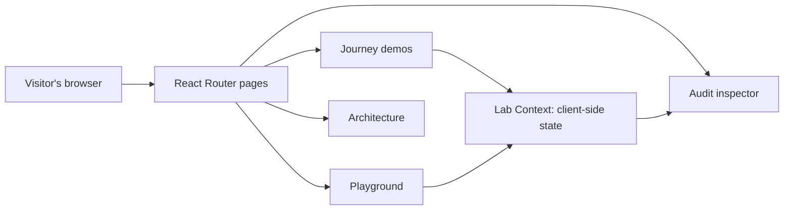
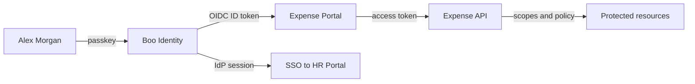

# Identity Evolution Lab

An interactive, frontend-only portfolio application that explains how modern Identity and Access Management (IAM) fits together. Follow Alex Morgan at fictional Boo Corp from a password login through sessions, TOTP, JWT access tokens, OAuth 2.0, OpenID Connect, SSO, passkeys, authorization, and identity operations.

> **This application is an educational IAM simulation. It is not intended to function as a production identity provider.** Credentials, tokens, cryptographic checks, QR enrollment, redirects, and WebAuthn ceremonies are illustrative client-side demonstrations.

## Explore the application

| Screen | What to try |
| --- | --- |
| Journey | Sign in as Alex, revoke a session, enable TOTP, alter a JWT claim, run an OAuth flow, reuse an IdP session, follow a passkey challenge, and test permissions. |
| Playground | Change authentication mode, role, scopes, token state, and API operation to compare 200, 401, and 403 decisions. |
| Architecture | Switch from a simple evolution timeline to four interacting domains, then follow a request through Boo Corp's modern identity architecture. |
| Audit | Inspect the structured client-side events produced by your actions. |
| About | Read the purpose, design choices, limits, and production considerations. |

# Deploy to GitHub Pages

The [Pages workflow](.github/workflows/deploy-pages.yml) runs only when started manually. In the repository's **Settings → Pages**, set **Build and deployment → Source** to **GitHub Actions**. Then open **Actions → Deploy to GitHub Pages → Run workflow** and choose the branch to publish. The expected project URL is `https://cosmomelon.github.io/Identity-Evolution-Lab/`.

The workflow builds with the repository path as Vite's base URL and includes a `404.html` fallback so direct links to the app's browser routes can load. Local development continues to use `/` as its base URL.

## Stack and architecture

- React 18, TypeScript, Vite, React Router, Tailwind CSS, and Lucide icons.
- Olive visual theme centered on `#bab83f`, with Domine headings and DM Sans interface text (with local serif/sans-serif fallbacks).
- One React Context manages demo progress, authentication flags, role/scopes, token state, SSO state, and audit events.
- All simulations use browser memory; refresh resets the lab.
- No API routes, server, database, Docker, or production authentication dependency.



`src/data/stages.ts` holds educational content and product trade-offs. `src/components/journey/` holds the interactive demos. `src/pages/` holds route-level layouts. `src/store/LabContext.tsx` connects actions to audit events.

## The identity evolution

| Layer | What it introduces | Core trade-off |
| --- | --- | --- |
| Password | Shared-secret authentication | Phishing, reuse, credential stuffing, and secure storage. |
| Server session | Opaque cookie linked to server state | Central revocation, but session storage and lifecycle management. |
| TOTP MFA | Time-based second factor | A stolen password alone is insufficient; live codes remain phishable. |
| Access token / JWT | Scoped API access; JWT is one token format | Signature and claim validation, expiry, refresh, key rotation, and revocation. |
| OAuth 2.0 | Delegated authorization | Redirect, state, PKCE, scope, and client handling. |
| OpenID Connect / SSO | Identity assertion and shared IdP trust | Token validation, provider availability, local app sessions, and logout. |
| WebAuthn / passkeys | Origin-bound public-key authentication | Strong phishing resistance, with recovery and device access design. |
| RBAC / scopes | Permissions after authentication | Consistent policy enforcement and review. |
| Audit / operations | Evidence, revocation, and recovery | Log integrity, privacy, retention, and strong fallback paths. |

The lab deliberately starts with a timeline, then reveals that IAM is composed of **simultaneous layers**. A passkey can authenticate Alex to Boo Identity. OIDC can let Expense Portal trust that result. A JWT access token can be presented to an API, which evaluates scopes and permissions. A server-side IdP session can still enable SSO.



### Technical distinctions taught by the demos

- **Authentication** asks who Alex is. **Authorization** asks what Alex may do.
- **OAuth 2.0** primarily addresses delegated authorization. **OpenID Connect** adds an identity layer with an ID token intended for a client.
- An **ID token** is consumed by its client. An **access token** is presented to an API.
- **JWT** is a structured token format, not a sign-in method. Access tokens can also be opaque.
- **Passkeys** authenticate a user to a relying party. **OIDC** can federate the result to client applications.
- **401** indicates missing or invalid authentication credentials. **403** indicates a recognized caller without sufficient permission.

## Security and simulation boundaries

The password demo compares a provided string in browser code. The displayed Argon2id-style hash is illustrative. The TOTP code and QR-like pattern are not linked to a real authenticator. The JWT has the correct three-part structure, but its signature and validation results are simulated. The OAuth/OIDC flow is a visual stepper without real redirects or token exchange. The passkey flow illustrates WebAuthn but does not invoke the WebAuthn browser API. Audit records exist only in memory and are not tamper-resistant.

Production implementations additionally need maintained identity and cryptography libraries, TLS, secure key and secret storage, registered redirect URI and origin checks, signed token validation, session and refresh-token storage, CSRF protection, rate limiting, account recovery safeguards, real audit infrastructure, privacy and retention policy, availability planning, and threat modeling. Use a mature identity provider or vetted framework for real authentication.

## Future enhancements

- Guided tour with timed checkpoints and an optional compact learning mode.
- More token-validation and policy scenarios, including ABAC examples.
- Exportable architecture diagrams and portfolio screenshots.
- Automated browser accessibility and interaction coverage.

## Project structure

```text
src/
  components/journey/  Interactive simulations and shared demo primitives
  data/stages.ts       Stage descriptions, security insights, trade-offs
  pages/               Landing, Journey, Playground, Architecture, Audit, About
  store/LabContext.tsx Client-side simulation state and audit events
  App.tsx              Route shell and navigation
  styles.css           Tailwind layers and visual system
```
